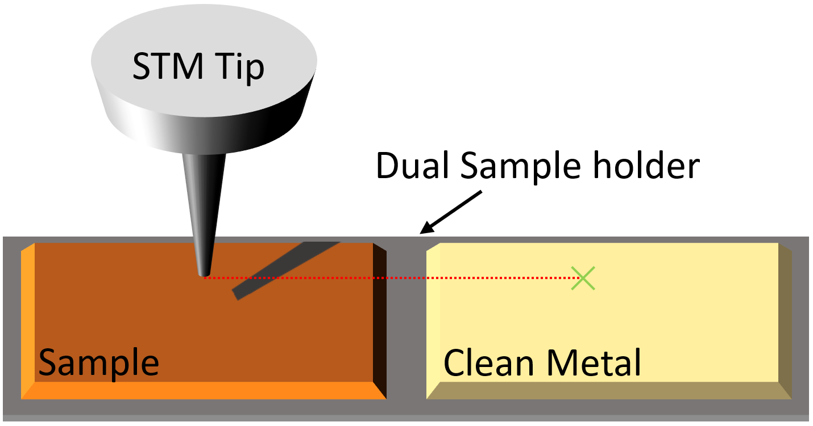
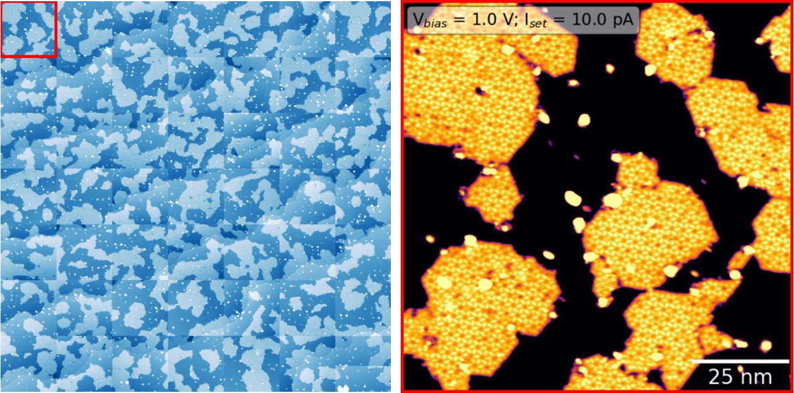

# Automation
## Overview
Scanbot's ultimate goal is to automate data acquisition and probe conditioning in STM/STS experiments. Although this may seem ambitious, Scanbot has already made significant progress
towards achieving this goal, including the development of automated imaging and tip preparation capabilities.
To prepare a high-quality tip, Scanbot leverages the use of a dual sample holder where a sample of interest can be mounted adjacent to a clean metal surface, ideal for tip preparation.

<br>

### Tip Preparation

Scanbot's ability to prepare a tip on a clean metal surface is demonstrated above. By gently pushing the apex of the scanning probe
into an atomically flat region of a metal surface, an imprint is left that reflects the geometry of the tip. This imprint can then be scanned,
and the resulting image is similar to the auto-correlation function of the tip's apex. The quality of the tip can be assessed by measuring the
area, symmetry, and center of mass of the imprint - for instance, the middle panel shows an imprint of a tip that is very likely doubled. If the
imprint does not meet the desired criteria, a more aggressive tip shaping action is carried out and the process is repeated until a
high-quality tip is achieved (left to right, above). Details about this process are given [below](#auto-tip-shaping).

<br>

### Dual Sample Holder Navigation
When the STM tip requires refinement, Scanbot moves it from the sample of interest to the clean metal surface on the dual sample holder.
To accomplish this, Scanbot uses the course motor to maneuver the STM tip while monitoring its position through a camera feed. After the tip has been refined,
it is moved back to the sample of interest, where a survey can be carried out.
In the video below, Scanbot is tracking the STM head as it moves the tip from the sample to the clean metal on the dual sample holder.

<br>


<br>

### Sample Surveying
After preparing a tip, scanbot can autonomously survey a sample of interest using the ```survey``` and ```survey2``` commands. The series of images acquired below were taken by Scanbot
of a real sample in our lab. Each image in the 7x7 grid is a 100 nm, 512x512 pixel topographic scan. Upon completion of the survey, Scanbot can retract the tip, move to a new location,
and begin acquiring a new survey. If the tip becomes unstable during a survey, Scanbot will automatically retract the tip and repreapre it according to the protocols above.


### In Development
At present, Scanbot examines STM images captured during surveys to assess the need for tip reshaping. However, its current algorithmic method is limited to identifying tip 
instability, but it lacks the capability to detect bluntness or duplication of the tip. Addressing this limitation is a priority. Enhancing the algorithm or adopting a 
sophisticated image classification system would significantly improve Scanbot's ability to accurately determine when the tip necessitates refinement.

There are several indicators that determine how aggressive the tip shaping action should be when refining the scanning probe.
Thus, the algorithmic approach used by Scanbot for tip shaping could benefit greatly from the integration of a machine learning agent.
Although the algorithmic approach is straightforward, it may take some time to achieve the desired tip shape. Fortunately, the algorithmic
method can serve as a stepping stone to machine learning, as it generates a quantitative measurement of the tip's condition before and after a known tip-shaping maneuver.
Through the operation of Scanbot, these measurements will be used to build a training dataset that can be used to train an AI agent to perform the task more efficiently.

At present, the tip shaping criteria overlook the spectroscopic performance of the STM tip. Here, it is possible to leverage the well-known Shockley surface states of
(111) metal surfaces, using them as a benchmark to compare STS obtained by the tip on a clean metal surface. As a result, an additional criterion could ensure that
the spectra obtained using the tip on a clean metal surface closely corresponds to the anticipated Shockley surface state.
Thanks to [Wang, et al.](https://pubs.acs.org/doi/pdf/10.1021/acs.jpca.0c10731), the groundwork for this has already been done so integrating this feature into Scanbot should be trivial!
In addition to this, automated STS commands are also in development.

<br><br><br>
