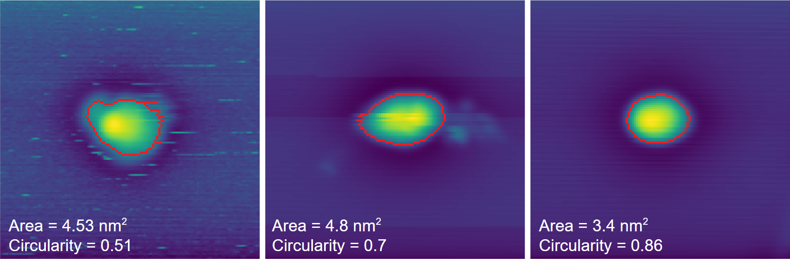

# Automation
## Overview
Scanbot's ultimate goal is to automate data acquisition and probe conditioning in STM/STS experiments. Although this may seem ambitious, Scanbot has already made significant progress
towards achieving this goal, including the development of automated imaging and tip preparation capabilities.
To prepare a high-quality tip, Scanbot leverages the use of a dual sample holder where a sample of interest can be mounted adjacent to a clean metal surface, ideal for tip preparation.

<br>

### Tip Preparation

Scanbot's ability to prepare a tip on a clean metal surface is demonstrated above. By gently pushing the apex of the scanning probe
into an atomically flat region of a metal surface, an imprint is left that reflects the geometry of the tip. This imprint can then be scanned,
and the resulting image is similar to the auto-correlation function of the tip's apex. The quality of the tip can be assessed by measuring the
area, symmetry, and center of mass of the imprint - for instance, the middle panel shows an imprint of a tip that is very likely doubled. If the
imprint does not meet the desired criteria, a more aggressive tip shaping action is carried out and the process is repeated until a
high-quality tip is achieved (left to right, above). Details about this process are given [below](#auto-tip-shaping).

<br>

### Dual Sample Holder Navigation
When the STM tip requires refinement, Scanbot moves it from the sample of interest to the clean metal surface on the dual sample holder.
To accomplish this, Scanbot uses the course motor to maneuver the STM tip while monitoring its position through a camera feed. After the tip has been refined,
it is moved back to the sample of interest, where a survey can be carried out.
In the video below, Scanbot is tracking the STM head as it moves the tip from the sample to the clean metal on the dual sample holder.


<br>

### In Development
At present, the tip shaping criteria overlook the spectroscopic performance of the STM tip. Here, it is possible to leverage the well-known Shockley surface states of
(111) metal surfaces, using them as a benchmark to compare STS obtained by the tip on a clean metal surface. As a result, an additional criterion could ensure that
the spectra obtained using the tip on a clean metal surface closely corresponds to the anticipated Shockley surface state.
Thanks to [Wang, et al.](https://pubs.acs.org/doi/pdf/10.1021/acs.jpca.0c10731), the groundwork for this has already been done so integrating this feature into Scanbot should be trivial!
In addition to this, automated STS commands are also in development.

There are several indicators that determine how aggressive the tip shaping action should be when refining the scanning probe.
Thus, the algorithmic approach used by Scanbot for tip shaping could benefit greatly from the integration of a machine learning agent.
Although the algorithmic approach is straightforward, it may take some time to achieve the desired tip shape. Fortunately, the algorithmic
method can serve as a stepping stone to machine learning, as it generates a quantitative measurement of the tip's condition before and after a known tip-shaping maneuver.
Through the operation of Scanbot, these measurements will be used to build a training dataset that can be used to train an AI agent to perform the task more efficiently.

<br>

## Intended Usage
This section describes how the automation aspect of Scanbot can be used for supervised or unsupervised operation. Note that you can still take advantage of Scanbot's
[data acquisition commands](../commands/#data-acquisition) without automating the entire process.

### 1. Setup
These steps must be carried out before Scanbot is able to automatically move the tip between the sample and the clean metal.

1. Drive the STM tip to a location in close proximity to the sample, making sure the STM tip, sample of interest, and clean metal surface are in clear view of the camera. 
2. Run the ```auto_init``` command. This will initialise the locations of the STM tip, sample, and clean metal.
    - Draw a box around the length of the entire tip, encapsulating some of the tip holder in the frame like in the video above.
    - Place a marker at the apex of the tip.
    - Place a marker at a safe distance above the clean metal.
    - Place a marker at a safe distance above the sample.
    - **Note: Close any other applications that use the camera as they might prevent Scanbot from accessing it.**
    - **Note2: If the course piezos are moved manually at any point, Scanbot will have incorrect information about the location of the tip and this process must be repeated.**

### 2. End-to-End Supervised Test
**It is advised to go through these steps, especially steps 1 and 3, each time ```auto_init``` is run.**

1. Run the ```move_tip_to_clean``` command. This will move the tip to the location you set above the clean metal and begin an auto approach.
    - **Configure the correct piezo voltages, frequency, and number of steps for your machine** (see [commands](commands.md) or run ```help move_tip_to_clean```).
    - Observe the camera feed and ensure the tip is tracked correctly. If not, run ```stop```, then rerun ```auto_init``` and carefully draw a new box around the tip.
    - Note: run the ```stop``` command at any time to abort.
2. Once the tip has approached, run ```auto_tip_shape``` with the appropriate inputs for your system (e.g. metal used, etc.).
    - This function may take some time, for testing purposes run the ```stop``` command once you've [verified it's working correctly](#auto-tip-shaping).
3. Next run the ```move_tip_to_sample``` command.
    - Observe the camera feed and ensure the tip is tracked correctly.
4. Once the tip has approached, start a survey using the ```survey``` or ```survey2``` command.

### 3. Supervised Operation Example
1. After setup, run the ```move_tip_to_sample``` command.
2. Upon approach, start a ```survey``` leaving ```-autotip=0```.
3. Periodically monitor the scans stream (for Zulip users, each scan will be sent through the steam the survey was started from).
4. If the tip requires refinement, run ```stop``` followed by ```move_tip_to_clean``` with the options ```-tipshape=1```, ```-return=1```, and ```-run=survey```
    - Here, Scanbot will automatically move the tip to the clean metal location set in ```auto_init```
    - With ```-tipshape=1```, the auto tip shaping process will begin after approaching
    - With ```-return=1```, Scanbot will move the tip back to the sample location set in ```auto_init```
    - With ```-run=survey```, Scanbot will begin a survey with the same options as the previous survey
    - **Note: If the function passed to the -run option has not been run previously, the default parameters will be used - check them to ensure they are compatible with your system in this case.**

### 4. Fully Automated Operation
1. After setup, run the ```survey``` or ```survey2``` command with the ```-autotip=1``` option.
    - This will begin a survey and each scan will be analysed.
    - When scanbot detects that the tip is unstable, it will automatically navigate the tip to the clean metal surface and initiate the ```auto_tip_shape``` command.
    - Once the tip is refined, it will be moved back to the sample and the survey will continue.

**Note:** Although Scanbot excels at identifying noisy images resulting from tip-sample interaction, its capacity to evaluate overall image quality remains restricted.
While it can detect unstable tips, **it cannot identify doubled tips**. In the event of a tip alteration resulting in multiple tips, Scanbot will not endeavor to reshape it.
However, if the tip becomes unstable, Scanbot will recognise this and refine the tip accordingly.

**Note2: Scanbot requires a camera feed to track the tip during automated operation.** For this reason, there is a configurable [hook](../hooks/#hk_light) that will allow Scanbot to control the STM light when required.
<br>

## Operation Details

### Auto Tip Shaping
The ```auto_tip_shape``` command is executed as follows:

1. A small scan (```wh=<scan_size>```) of the clean surface will be acquired.
    - The scan will be monitored line by line and if the area is contaminated or contains a step edge, the scan will be stopped and the scan frame will be moved.
2. If the small scan completes and the area is clean, a light tip shape (~0.8 nm) will be performed in the centre of the frame.
3. The imprint of the tip will be imaged.
4. The contour of the imprint's enclosed area and circularity will be calculated and compared against the criteria set by the options ```-size=<area_in_nm2>``` and ```-sym=<score_0-1>```, respectively.
5. If the criteria are met, a successful tip shape is declared and the process stops here. Otherwise, a more aggressive tip shape is carried out and the process starts over.
6. In the event where the entire scan region is either unsuitable for tip shaping or the area has been destroyed by tip shaping, Scanbot will automatically call the ```move_area``` command, before continuing.

### Auto Tip Maneuvering
The primary concern when it comes to automating movement of the STM head is accidental tip crashes.
The following rules have been applied to any command where the course piezos are utilised:
<br>

- The tip can never be moved in the ```Z-``` direction (down) when using the course piezo. Instead, auto approach is used.
- When moving in ```X``` or ```Y``` directions, the tunnelling current must be monitored after every 10 steps.
- A tunnelling current greater than the threshold set in the config file is considered a crash (see [Tip Crash Safety](../configuration/#tip-crash-safety)).
- In the event of a crash, the tip will be retracted using the ```Z+``` piezo and operation will cease.

**Please make sure to set appropriate piezo voltages and frequencies when using any of the commands that control the course piezos. You can configure voltage and frequency limits in the [config file](../configuration/#piezo-safety).**
<br><br><br>
