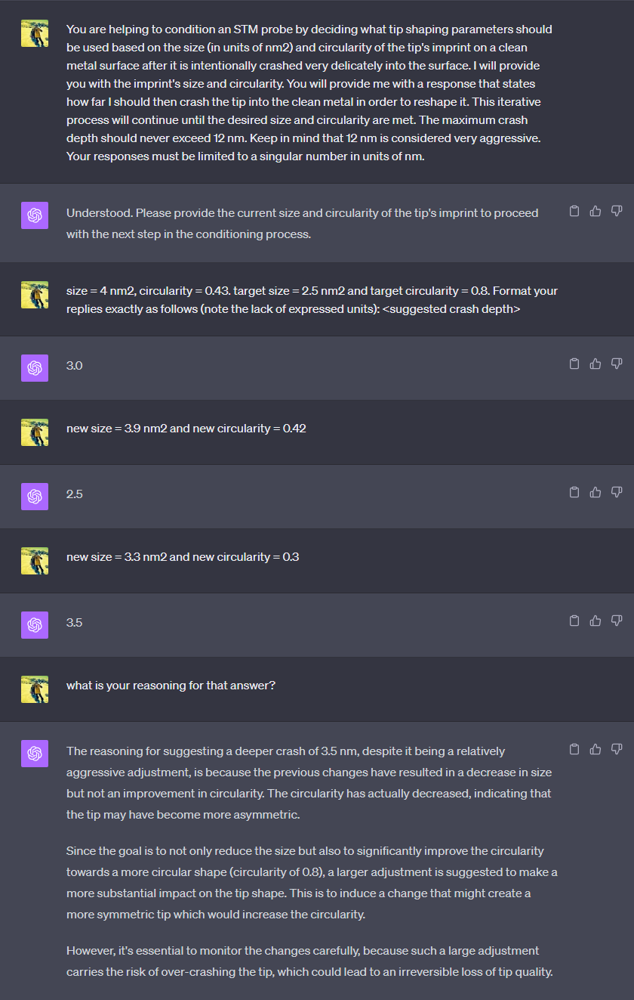

# Featured
<br>
## Scanbot meets ChatGPT
<br>
When preparing a new tip, Scanbot lightly crashes the apex into the surface and analyses an image of the imprint left behind to determine whether the tip is suitable for imaging.
In the example hk_tipShape below, the OpenAI API is used to send the size (in units of nm2) and circularity of the tip's imprint to ChatGPT. ChatGPT is instructed to respond with a suggestion for
what tip-shaping parameters to try next. This has been surprisingly effective for the little effort it takes!
See [here](../hooks) for more details about how hooks work with Scanbot.



### hk_tipShape.py
```Python
import openai # This example is compatible with openai version 0.27.4

def run(cleanImage, tipImprint, tipShapeProps, target, actual, history):
    """
    This hook calls the ChatGPT API to seek guidance on how aggressive the next 
    tip shape should be. In this example, only the crash depth is considered, 
    but you can see how easily other parameters, such as bias or tip pulsing 
    can be considered too.

    Parameters
    ----------
    cleanImage : Image of the substrate before the tip shape (Not used in this example)
    tipImprint : Image of the imprint after a light tip shape (Not used in this example)
    tipShapeProps : Tip shaping parameters.
    target : Target size and circularity of the imprint [0]=size, [1]=symm
    actual : Actual size and circularity of the imprint [0]=size, [1]=symm
    history : An in-out variable to keep track of past calls to this function.
              (In this example, history keeps a running record of the dialogue
               to ChatGPT)

    Returns
    -------
    tipShapeProps : Tip-shaping properties modified by this routine
    history : An in-out variable to keep track of past calls to this function.
              (In this example, history keeps a running record of the dialogue
               to ChatGPT)
    """
    
    openai.organization = "org-ty5pA0i9NIRV1ZF0Trweflf1"                        # OpenAI
    openai.api_key = "xx-xxxxxxxxxxxxxxxxxxxxxxxxxxxxxxxxxxxxxxxxxxxxxxxx"      # Your OpenAI API key (see OpenAI API documentation for how to create a key)
    
    messages = history                                                          # Running dialogue with ChatGPT
    if(not len(messages)):                                                      # This must be the first time this hook was called
        # Give a prompt to ChatGPT to explain to it what it's role is...
        systemPrompt  = "You are helping to condition an STM probe by deciding what tip shaping parameters should be used based on the size (in units of nm2) and circularity "
        systemPrompt += "of the tip's imprint on a clean metal surface after it is intentionally crashed very delicately into the surface. I will provide you with the imprint's "
        systemPrompt += "size and circularity. You will provide me with a response that states how far I should then crash the tip into "
        systemPrompt += "the clean metal in order to reshape it. This iterative process will continue until the desired size and circularity are met. "
        systemPrompt += "The maximum crash depth should never exceed 12 nm. Keep in mind that 12 nm is considered very aggressive. "
        systemPrompt += "Your responses must be limited to a singular number in units of nm."
        
        # Sending a message like this first seems to improve future replies
        size = str(actual[0])
        symm = str(actual[1])
        firstMessage  = "size=" + size + ", "
        firstMessage += "circularity=" + symm + ". "
        
        targetSize = str(target[0])
        targetSymm = str(target[1])
        firstMessage += "Desired maximum size = " + targetSize + ", "
        firstMessage += "Desired minimum circularity = " + targetSymm + ". "
        
        firstMessage += "Format your replies exactly as follows (note the lack of expressed units): <suggested crash depth>"
        
        messages.append({"role": "system", "content": systemPrompt})
        messages.append({"role": "user", "content": firstMessage})
    else:
        # Build a message from the "user"
        role    = "user"
        content = "size=" + str(actual[0]) + "circularity=" + str(actual[1])
        messages.append({"role": role, "content": content})                     # Send a message containing the measured size and symmetry of the imprint.
    
    completion = openai.ChatCompletion.create(                                  # Send the message, along with the full message dialogue history and recieve response
      model="gpt-4",
      messages=messages
    )
    
    messages.append(completion.choices[0].message)                              # Append the latest message to the running dialogue history
    history = messages                                                          # Pass out the message history so it can be passed back in on the next call
    
    z1 = float(completion.choices[0].message["content"]) * -1e-9                # Tip shape depth determined by ChatGPT
    z2 = -2*z1                                                                  # Tip lift is double the depth
    tipShapeProps[3] = z1                                                       # Amount to plunge the tip into the surface (m)
    tipShapeProps[7] = z2                                                       # Amount to pull tip out of the surface (m)
    
    print("ChatGPT says tip shape z1 = " + str(z1*1e9) + " nm")
    
    return tipShapeProps,history                                                # Return the updated tip shaping properties and running history 
```