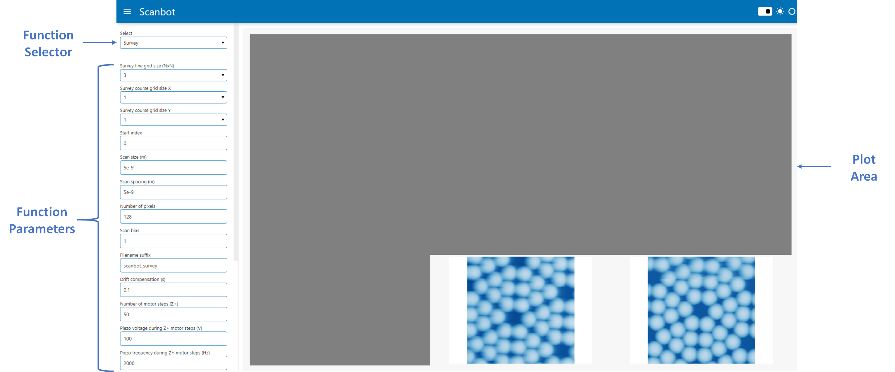
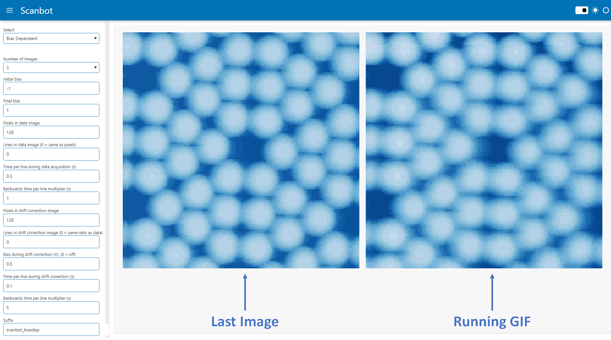
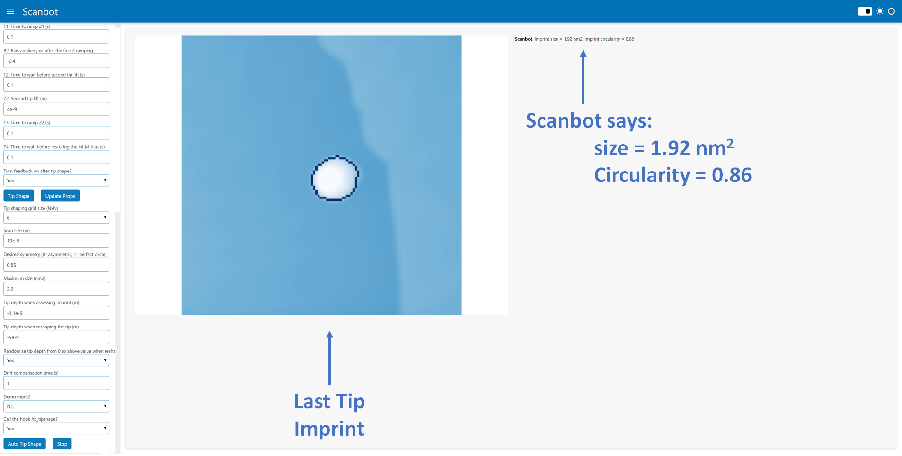

# Scanbot GUI

Thanks to [holoviz Panel](https://panel.holoviz.org/), Scanbot now has a GUI that runs in a browser.
This is still under active development, so not all of Scanbot's functionality is accessible from the GUI yet. 
Currently, the following functions have been implemented in the Scanbot GUI:

* Survey
* Bias Dependent Imaging
* STM Control
    - Move area
    - Tip Shape
    - Auto Tip Shape
* End-To-End Automation

## Overview

Scanbot can be started in GUI mode by running the command ```python scanbot_interface.py -gui``` from ~/scanbot/scanbot
The Scanbot GUI is split into two panels: the side panel and the plot area. The side panel is where functions and parameters can be selected,
and the plot area is where messages and images are displayed.




## Survey

When the Survey function is selected, the following parameters can be configured:

| Parameter                                            | Description                                                                                                                                                                                                                                                                                                                             |
|------------------------------------------------------|-----------------------------------------------------------------------------------------------------------------------------------------------------------------------------------------------------------------------------------------------------------------------------------------------------------------------------------------|
| Survey fine grid size (NxN)                          | Surveys are grids of images. This parameter defines the grid size. For example, if N=3, the survey grid will be 9 images in a 3x3 grid                                                                                                                                                                                                  |
| Survey course grid size X/Y                          | The course grid is a macroscopic grid of points on the sample where surveys will be carried out.<br>At the completion of each survey, the course piezos will move the tip to the next location in the course grid.<br>The course grid size is XxY.<br>For example, if X=5 and Y=2, a total of 10 fine-grid surveys will be carried out. |
| Scan size (m)                                        | Length and widthof each image in the survey in meters                                                                                                                                                                                                                                                                                   |
| Scan spacing (m)                                     | Spacing between images in a survey in meters                                                                                                                                                                                                                                                                                            |
| Number of pixels                                     | Number of pixels in each image in the survey                                                                                                                                                                                                                                                                                            |
| Scan bias (V)                                        | Bias the images in the survey will be acquired at                                                                                                                                                                                                                                                                                       |
| Filename suffix                                      | String that will be appended to the end of the .sxm filenames for all images acquired in the survey                                                                                                                                                                                                                                     |
| Drift compensation (s)                               | Number of seconds after which to restart each scan. This is to accommodate for drift induced by the scan frame moving.                                                                                                                                                                                                                  |
| Number of motor steps (Z+)                           | Number of motor steps the tip will retract before moving to the next survey location in the course grid                                                                                                                                                                                                                                 |
| Piezo voltage during Z+ motor steps (V)              | Voltage applied to the Z piezos when retracting the tip before moving to the next course grid location                                                                                                                                                                                                                                  |
| Piezo frequency during Z+ motor steps (Hz)           | Frequency applied to the Z piezos when retracting the tip before moving to the next course grid location                                                                                                                                                                                                                                |
| Number of motor steps (X/Y)                          | Number of piezo motor steps (after retracting in Z+) between course grid locations                                                                                                                                                                                                                                                      |
| Piezo voltage during X/Y motor steps (V)             | Voltage applied to the X/Y piezos when moving to the next course grid location                                                                                                                                                                                                                                                          |
| Piezo Frequency during X/Y motor steps (Hz)          | Frequency applied to the X/Y piezos when moving to the next course grid location                                                                                                                                                                                                                                                        |
| Call hk_survey.py after each image?                  | Answer 'Yes' if you've written a custom hk_hook.py hook that you want executed after each scan completes                                                                                                                                                                                                                                |
| Call hk_classifier.py instead of default classifier? | Answer 'Yes' if you've written a custom hk_classifier.py hook to analyse completed scans and determine if the tip needs reshaping                                                                                                                                                                                                       |
| Auto tip shaping?                                    | Answer 'Yes' if you want Scanbot to automatically move the tip to the clean reference metal and reshape the tip when it detects a bad tip                                                                                                                                                                                               |

## Bias Dependent Imaging

The bias dependent imaging function lets you take a series of drift-corrected images at different bias values. The plot area will show the latest image side-by-side with a GIF of all the previously acquired images in the set.


When the Bias Dependent function is selected, the following parameters can be configured:

| Parameter                                            | Description                                                                                                                                                                 |
|------------------------------------------------------|-----------------------------------------------------------------------------------------------------------------------------------------------------------------------------|
| Number of images                                     | Number of images to acquire between the initial and final bias                                                                                                              |
| Initial bias (V)                                     | Bias of the first image in the set                                                                                                                                          |
| Final bias (V)                                       | Bias of the final image in the set                                                                                                                                          |
| Pixels in data image                                 | Number of pixels in the bias dependent scans. This must be a multiple of 16 in nanonis                                                                                      |
| Lines in data image                                  | Number of lines in the bias dependent scans                                                                                                                                 |
| Time per line during data acquisition (s)            | Sets the forward speed of the tip during bias dependent scans                                                                                                               |
| Backwards time per line multiplier                   | Sets the backward speed of the tip during bias dependent scans. (2 = twice as fast as the forward speed)                                                                    |
| Pixels in drift correction image                     | Number of pixels during the frames taken for drift correction purposes.<br>A drift correction frame is acquired between each of the bias dependent scans at a constant bias |
| Lines in drift correction image                      | Number of lines during the frames taken for drift correction purposes.<br>Set this to 0 to keep the same ratio as pixels/lines in the bias dependent images                 |
| Bias during drift correction (V)                     | Bias that the drift correction frames are acquired at.<br>Set this to 0 to turn off drift correction                                                                        |
| Time per line during drift correction (s)            | Sets the forward speed of the tip when acquiring drift correction images                                                                                                    |
| Backwards time per line multiplier                   | Sets the backward speed of the tip during drift correction scans. (0.5 = half the speed as the forward speed)                                                               |
| Suffix                                               | Text to append to the .sxm filenames for all images in this set                                                                                                             |

## STM Control

There are three actions available in the STM control function: Move Area, Tip Shape, and Auto Tip Shape.

### Move Area

The Move Area action retracts the STM tip and moves it to a new location using the course piezos. The following parameters can be configured:

| Parameter                                            | Description                                                                                                                                                 |
|------------------------------------------------------|-------------------------------------------------------------------------------------------------------------------------------------------------------------|
| Steps to take in Z+ before moving in X/Y             | Retract the STM this many motor steps before moving across in X/Y to a new area                                                                             |
| Steps to move across                                 | Number of steps to move in either X/Y direction to a new area                                                                                               |
| Direction                                            | Can be one of X+, X-, Y+, Y- directions                                                                                                                     |
| Piezo amplitude during Z+ steps (V)                  | Voltage applied to the Z piezo when retracting the tip                                                                                                      |
| Piezo frequency during Z+ steps (Hz)                 | Frequency applied to the Z piezo when retracting the tip                                                                                                    |
| Piezo amplitude during X/Y steps (V)                 | Voltage applied to the X/Y piezo when retracting the tip                                                                                                    |
| Piezo frequency during X/Y steps (Hz)                | Frequency applied to the X/Y piezo when retracting the tip                                                                                                  |
| Turn z-controller on after move                      | Turn feedback on after approach                                                                                                                             |

### Tip Shape

This action simply implements the tip-shaping module in Scanbot. The following parameters which can be configured are the standard tip-shaping parameters:

| Parameter                                              | Description                                                                                                                               |
|--------------------------------------------------------|-------------------------------------------------------------------------------------------------------------------------------------------|
| Switch off delay (s)                                   | Time to wait before switching the controller off (z-position averaging)                                                                   |
| Change bias?                                           | Choose 'Yes' if you want to change the bias to B1 before executing tip shape                                                              |
| B1: Bias to change to if yes (V)                       | Bias applied at the beginning of the tip shape                                                                                            |
| Z1: First tip lift (m)                                 | Initial amount to lift the tip (e.g. -2e-9 pushes the tip down 2 nm)                                                                      |
| T1: Time to ramp Z1 (s)                                | Time taken to go from initial tip height to z1                                                                                            |
| B2: Bias applied just after the first Z ramping (V)    | Bias applied to the tip while it is in contact with the surface                                                                           |
| T2: Time to wait before second tip lift (s)            | Leave the tip in contact for this long                                                                                                    |
| Z2: Second tip lift (m)                                | Amount to lift the tip after crashing                                                                                                     |
| T3: Time to ramp Z2 (s)                                | Time taken to go from z1 to z2                                                                                                            |
| T4: Time to wait before restoring the initial bias (s) | Wait this much time before going back to the initial bias                                                                                 |
| Turn feedback on after tip shape?                      | Choose 'Yes' to turn on the z-controller after the tip shape is complete                                                                  |

### Auto Tip Shape

This action tells Scanbot to [automatically acquire a tip](../automation/#tip-preparation) suitable for imaging. The process is as follows:

1. An NxN grid is setup within the scannable region
2. A small scan is acquired at the first location in the grid
3. If the scanned region is flat/clean, it is deemed suitable for creating an imprint. If not, the scan frame is moved to the next location in the grid and the process repeats
4. The tip apex creates an imprint in the middle of the scan window
5. The imprint of the tip apex is imaged
6. The imprint is analysed and given size score (in units of nm2) and a circularity score (from 0 to 1)
7. If the target size and circularity values are not met, the scan frame moves to the next location and the process is repeated
8. If the target size and circularity values are met, the process completes

| Parameter                                                 | Description                                                                                                                                                                               |
|-----------------------------------------------------------|-------------------------------------------------------------------------------------------------------------------------------------------------------------------------------------------|
| Tip shaping grid size (NxN)                               | The total number of tip-shaping attempts will be NxN                                                                                                                                      |
| Scan size (m)                                             | Size of the scan window when imaging the tip imprint                                                                                                                                      |
| Desired symmetry (0=asymmetric, 1=perfect circle)         | Circularity score that needs to be met before tip-shaping is successful.<br>The imprint circularity is calculated by analysing its contour.<br>0.85 or more will generally be good enough |
| Maximum size (nm2)                                        | Maximum area in units of nm2 of the imprint.<br>This will vary for different metal surfaces.<br>2.5 is a good starting point                                                              |
| Tip depth when assessing imprint (m)                      | Amount to crash the tip when creating an imprint to be analysed.<br>This will vary for different metal surfaces.<br>-1.1e-9 is a good starting point                                      |
| Tip depth when reshaping the tip (m)                      | Maximum amount to crash the tip when reshaping it.<br>-10e-9 to -15e-9 is a good starting point if the rng is turned on                                                                   |
| Randomise tip depth from 0 to above value when reshaping? | Randomising the tip crash depth from zero to a maximum value seems to work better than try the same value over and over.<br>Generally select 'Yes' for this option                        |
| Drift compensation time (s)                               | Restarts each scan after this many seconds to compensate for drift when moving scan frames.<br>1 s is generally ok here                                                                   |
| Demo mode?                                                | Load pngs from a pickled file instead of scan window (useful for testing purposes only - contact me if you want a test.pk)                                                                |
| Call the hook hk_tipshape?                                | Call your own hk_tipshape.py hook to configure custom tip-shaping parameters based on images of the tip's imprint                                                                         |



## STM Automation

This function allows Scanbot to take control of the STM course piezos and move the tip between the sample and clean metal locations. It also lets Scanbot automatically initiate tip shaping and sample surveying.
The process is described in more details [here](..automation/#intended-usage). Below are the parameters to configure:

| Parameter                                                 | Description                                                                                                                                                                                                                                     |
|-----------------------------------------------------------|-------------------------------------------------------------------------------------------------------------------------------------------------------------------------------------------------------------------------------------------------|
| Control light with hk_light.py?                           | Answer 'Yes' if you have a custom hk_light.py hook that allows Scanbot to turn the light on and off when using the camera feed to move the tip                                                                                                  |
| Camera port                                               | Port of the camera.<br>Usually 0 for PCs if you don't have another webcam plugged in.<br>Usually 1 for laptops with inbuilt webcams.<br>Note that the STM camera should not be open in any other software while Scanbot is trying to access it. |
| Demo/Live mode                                            | Use a video recording of the tip moving instead of a camera feed (testing only).<br>Contact me if you would like testing files to run in demo mode.                                                                                             |
| Steps at a time in Z+ direction                           | Number of steps to take between camera frames.<br>More moves the tip faster.<br>Too much means Scanbot will lose track of the tip                                                                                                               |
| Piezo voltage when moving tip in Z+ (V)                   | Voltage applied to the Z+ piezo when lifting the tip                                                                                                                                                                                            |
| Piezo frequency when moving tip in Z+ (Hz)                | Frequency applied to the piezo when lifting the tip                                                                                                                                                                                             |
| Steps at a time in X+/- direction                         | Number of steps to take between camera frames.<br>More moves the tip faster.<br>Too much means Scanbot will lose track of the tip                                                                                                               |
| Piezo voltage when moving tip in X+/- (V)                 | Voltage applied to the X piezo when moving the tip between sample and clean metal                                                                                                                                                               |
| Piezo frequency when moving tip in X+/- (Hz)              | Frequency applied to the X piezo when moving the tip between sample and clean metal                                                                                                                                                             |
| Approach when tip reaches target?                         | Answer 'Yes' to turn on auto approach when the tip reaches its destination                                                                                                                                                                      |
| Initiate auto tip shape on approach? (Move to metal only) | Applicable when moving the tip from the sample to the clean metal and you answered 'Yes' to the above question.<br>Answer 'Yes' to automatically initiate tip shaping when the tip reaches the clean metal.                                     |
| Call hk_tipShape.py when auto tip shaping?                | Applicable when you answer 'Yes' to the above question.<br>Answer 'Yes' to call the custom hk_tipShape.py hook during the automated tip shaping.<br>See [hooks](../hooks/#hk_tipshape) for more details.                                        |
| Return to sample after auto tip shape?                    | Applicable when you answer 'Yes' to the above question<br>Answer 'Yes' to tell Scanbot to return to the sample after auto tip shaping completes                                                                                                 |
| Run a survey upon return?                                 | Applicable when you answer 'Yes' to the above question<br>Answer 'Yes' to tell Scanbot to initiate a survey upon returning the tip to the sample after auto tip shaping.                                                                        |
