# Testing Scanbot with the Nanonis V5 Simulator

This page provides detailed instructions about how you can try Scanbot using the Nanonis V5 Simulator.
Completing all of these tests will take approximately one hour.

<strong>When navigating the web application, avoid using the browser back and forward buttons. To go back one page, use the buttons located in the top right.</strong>

## Installation (5 min)

1. Download [Scanbot](https://firebasestorage.googleapis.com/v0/b/scanbot-46390.appspot.com/o/scanbot-react%2FScanbot_V4.zip?alt=media&token=1c627e79-422e-41e9-9d85-dd12835c3386)
2. Download [Nanonis V5 Simulator](https://www.specs-group.com/nanonis/products/mimea/#c1265)

## Launching Scanbot (5 min)

### Nanonis V5 Simulator
1. Open the Nanonis V5 Simulator
2. In the 'Current' module, change the Gain to LN 10^9. <strong>If your version of the simulator does not have this setting you can ignore this step.</strong>
 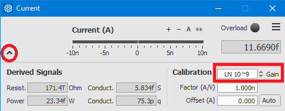 
3. In the Z-Controller module, turn on the Controller. Ensure the tip is 'tunnelling' at the correct setpoint.
 
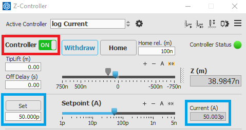
 
4. From the Scan Control module in Nanonis, ensure all images are being autosaved. <strong>This is essential for proper operation of Scanbot</strong>. It's also useful to turn on the auto-paste option too.
 
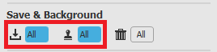
 

### Launch Scanbot
1. Open Scanbot.exe. A terminal will open and you should see the server start.
 
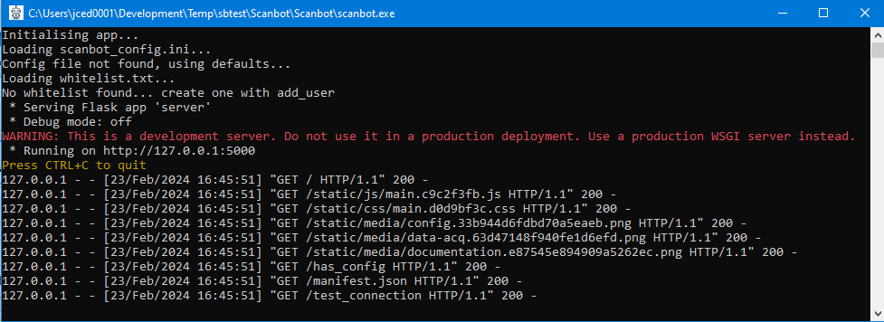
 
2. Scanbot should then open in a new browser tab. If it does not, then navigate to [http://127.0.0.1:5000](http://127.0.0.1:5000).
When running Scanbot for the first time, you will see a warning letting you know that you have not yet reviewed the configuration.
You may receive an additional warning message if Scanbot is unable to communicate to Nanonis. This will be solved in the next step.
 
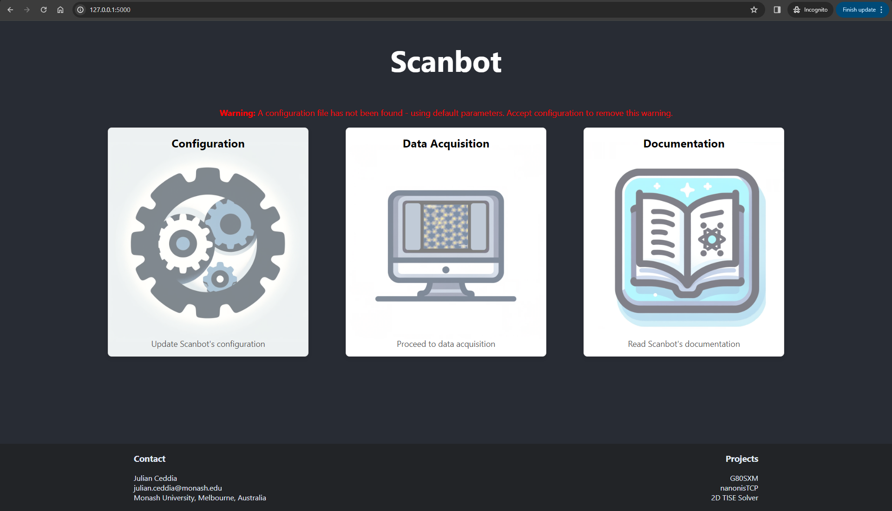
 

## Configuration (2 min)
1. In Nanonis, check the TCP ports from system => options => TCP Programming Interface.
 
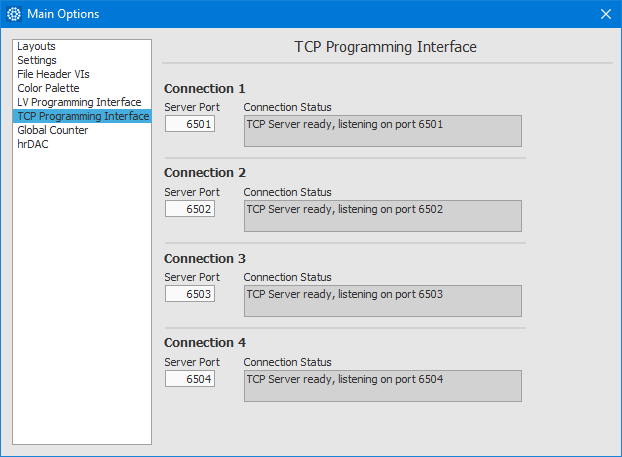
 
2. From the Scanbot landing page, navigate to the 'Configuration' page.
3. Ensure that the comma-delimited ports in Scanbot match those configured in Nanonis.
 

 
4. When running Scanbot using the simulator, the default configuration is ok. Accept the configuration. This will save the scanbot_config.ini file and your settings will be remembered.
Accepting the configuration will also stop the warning message from being displayed.

## Sample Surveying (10 min)
1. From the Scanbot landing page, navigate to 'Data Acquisition' => 'Survey'.
2. Review the survey settings. More details about these settings can be found in the [user guide](../web-app/#survey).
Alternatively, you can hover over any field to obtain its description. In summary:
 
    * The Fine Grid Parameters control the size and spacing of each survey grid.
    * The Coarse Grid Parameters control the number of surveys to acquire (at different macroscopic locations) and the spacing between them.
      <strong>Note: The motor controller in the Nanonis simulator is not sufficient for testing the coarse movement of the STM tip, thus please leave the coarse grid size to 1x1.</strong>
    * The Scan Parameters configure the settings for individual scans.
 
<strong>Note: At this stage, you will not be able to answer "Yes" to "Automated Tip Shaping?". We'll go through that later.</strong>
3. Once you're satisfied with the survey parameters, click 'Start Survey'. Acquired images will begin populating the empty grid.
You can either wait for the survey to complete or stop it any time with the 'Stop' button.
 
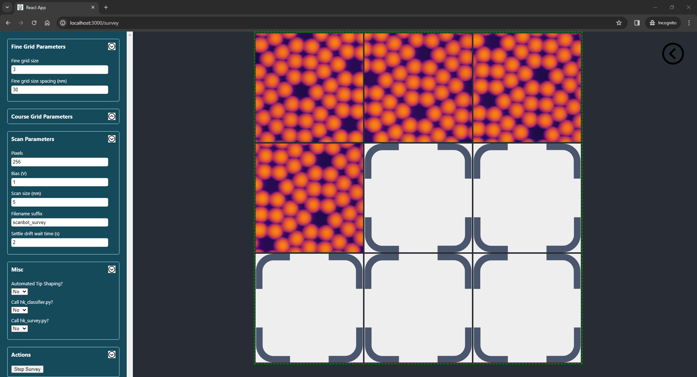
 

## Automated Tip Shaping (10 min)
The automatic tip shaping process is outlined [here](../web-app/#automated-tip-shaping).
In Summary:
 

1.	An initial upward scan will be acquired to make sure the area is suitable for tip shaping. If it is not suitable (i.e. there is debris), the scan frame will move to the next location in the grid.
2.	A tip-shaping action will be performed in the centre of the scan frame.
3.	A downward scan will acquire an image of the imprint left behind.
4.	From this image, the imprint size and circularity will be calculated.
5.	If the imprint size and circularity do not meet the desired criteria, a more aggressive tip-shaping action will be performed and the process repeats.
 

<strong>With Scanbot:</strong>

1. From the landing page navigate to 'Data Acquisition' => 'Automation'.
2. In Nanonis, from the 'Scan Control' module, open the 'Tip Shaper' module.
 
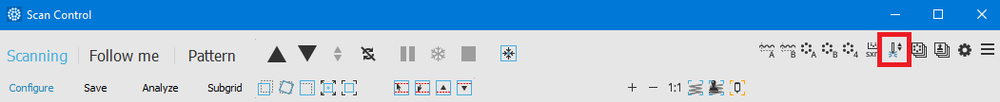
 
3. In Nanonis, from 'Graphs', open the 'Signal Chart'. This can be used to monitor Scanbot's tip shaping actions (as well as looking at the parameters in the Tip Shaper module).
Select the 'Current (A)' and 'Z (m)' channels. You can adjust the 'Averaging' slider to slow down the rate at which the curves move through the window.
In the figure below, the tip was at an intial height of -2 nm, then moved 3 nm into the surface and retracted 8 nm before turning the feedback controller on. During this time, the current spiked to its maximum value of 10 nA.
 
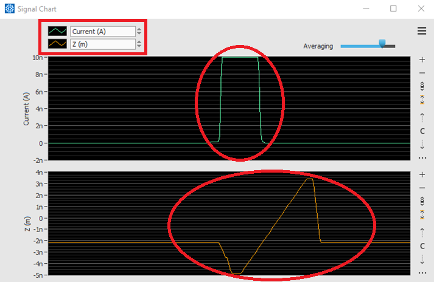
 
4. <strong>When running with the Nanonis Simulator, please obey the following in the 'Automated Tip Shaping' settings:</strong>
 
    * <strong>Select "Yes" for "Run in demo mode?".</strong>
        In demo mode, acquired images are replaced with pre-recorded data which is loaded from a file.
    * <strong>The scans loaded from this file are (10x10) nm in size.</strong>
        It is important that the settings in Scanbot reflect that or the size of the tip’s imprint will be calculated incorrectly.
    * <strong>The last imprint in the demo data has an imprint size of 1.55 nm2 and a circularity of 0.83.</strong>
        Set the parameters for desired size and circularity appropriate to these numbers.
5. Click 'Start'
6. <strong>You may find that the scan frame repeatedly moves before a scan is able to complete.</strong>
This is because Scanbot ensures that the area is flat before performing a tip-shaping action.
If the area is not flat, Scanbot will continue searching for a region appropriate for tip shaping.
The simulator scans are not flat, thus one can withdraw the tip to trick Scanbot into thinking the region being scanned is flat and appropriate for tip shaping.
7. Scans of the tip's imprint, along with its calculated size and circularity, after each iteration will be shown in the browser.
Remember that in demo mode, these scans are pulled from a pre-loaded file so they will look different to what's shown in the Nanonis Scan Control module.
 
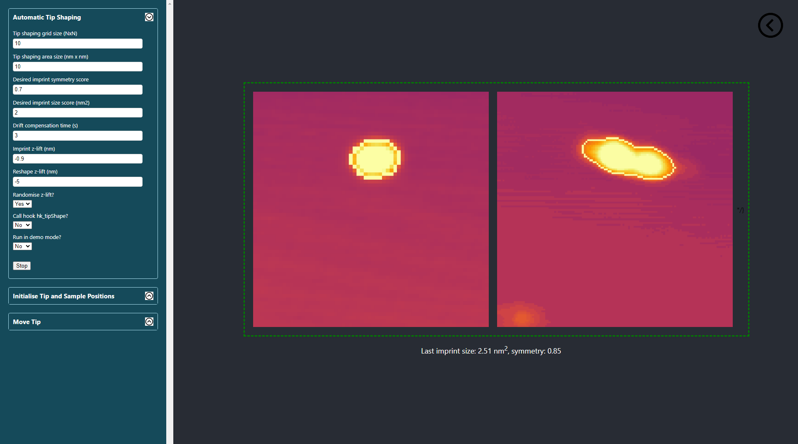
 
8. The process will finish when the tip imprint's area is smaller than the desired area <strong>and</strong> the circularity is larger than the desired.

## Autonomous Tip Navigation (10 min)
Before Scanbot can take control over the coarse piezos and track the tip via the camera feed, a short initialisation procedure must be completed.
This procedure gives Scanbot the initial location of the probe as well as the coordinates of the sample and clean metal.
This is normally accomplished via a live camera feed, however in Demo mode, the camera feed is replaced with pre-recorded videos.

### Initialisation
1. From the landing page, navigate to 'Data Acquisition' => 'Automation'.
2. Under the "Initialise Tip and Sample Positions" group, select "Yes" for 'Run in demo mode'.
3. Click the "Initialise" button.
4. Because demo mode was selected, a popup should open displaying a pre-recorded video. <strong>Note that the popup may not take focus</strong>.
5. Follow the prompts in the top left of the popup. They will be in the following order:
    1. The recording will show a view of the STM with the tip fully retracted and out of view. Click anywhere within the frame to go to the next step.
    2. The recording will show the tip in close proximity to the sample surface. Click anywhere within the frame to go to the next step.
    3. Mark the location at the apex of the probe by clicking on it.
    4. Mark a location in close proximity to, but at a safe distance from the clean metal surface.
    5. Mark a location in close proximity to, but at a safe distance from the sample surface.
    6. A preview of the locations you have initialised will be shown. <strong>Press 'q' to close and finish the initialisation, otherwise the window will close by itself after 30 seconds.</strong>
        Your initialisation should look something like the figure below:
     
    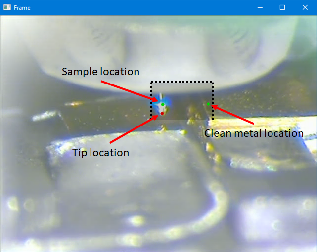
     
    <strong>Note: the dotted line represents the path of the tip in the video recording.
    Placing the sample or metal coordinates outside the shaded region means that the tip will never reach them.
    </strong>

### Tip Tracking Test
1. Review the settings in the 'Move Tip' group. In live mode, these must be configured appropriate to your setup. Since we're running this in demo mode, the defaults are ok.
2. In Nanonis, from the Z-Controller, open the Auto Approach module
 
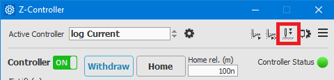
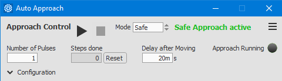
 
3. In Scanbot, click the 'Go to Metal' button
4. A popup video feed will open showing the STM tip move from its current position to the clean metal. The red marker will track the tip as it moves towards its target.
 
 
<strong>Note:</strong> This is programmed so that the tip retracts in Z+ until its Z-coordinate is above the target Z-coordinate.
Once the tip apex is above the target location, it then starts moving in the X direction towards the target (with the requirement that Ztip > Ztarget at all times when moving in X).
Once the X-coordinate of the tip matches the X-coordinate of the target, it has reached its destination <strong>and Scanbot will initiate auto approach</strong>.

## Survey Automation with Tip Tracking and Shaping (15 min)
Normally, Scanbot will remember the location of the STM tip after any such movement performed in the previous step.
A limitation to running the initialisation in demo mode is that the video recording of the tip restarts from the beginning each time.
This means the STM tip will not be at the location that Scanbot thinks it is, <strong>thus the initialisation procedure must be performed again for this test</strong>.

### Initialisation
1. Follow the initialisation steps in the previous test.
<strong>Now that we're confident that the tip can be tracked via the camera feed, this time you can initialise the sample and metal coordinates as shown:</strong>
 
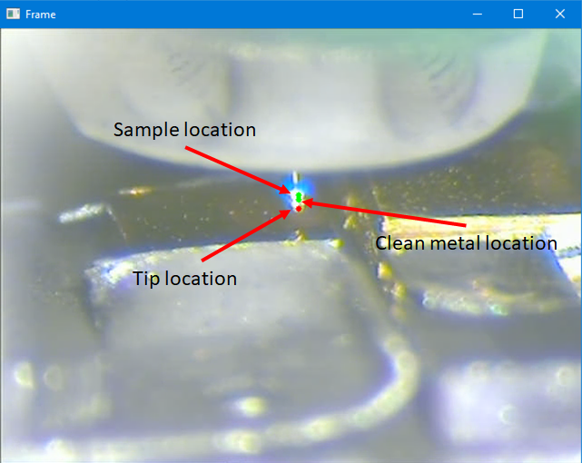
 
<strong>Setting the initial coordinates in this state lets the tip move back and forth between sample and metal locations without Scanbot losing track of the STM tip when the video recording restarts between movements.</strong>

### Survey with Auto Tip Shaping
1. Ensure the 'Auto Approach' and 'Tip Shaper' modules are open.
2. Use the button in the top right to navigate back to the 'Data Acquisition' page.
3. Navigate to the 'Survey' screen.
4. Select at least 3 for the fine grid size.
5. Choose “Yes” for "Automated Tip Shaping?".
6. “Start Survey”.

Because we ran the initialisation procedure in demo mode, starting the survey with "Automated Tip Shaping" = "Yes", means that the survey will also be run in a demo mode.
<strong>Images acquired from the Nanonis Simulator will be replaced with pre-loaded mock 'bad data'.</strong>
This is to give Scanbot the impression that the STM tip is in need of reshaping (despite running on a simulator).
The process for survey automation is as follows:

1. Acquired images are analysed by Scanbot and deemed good or bad depending on the number of tip changes and how much the tip interacts with the sample.
2. If five 'bad' images are detected in a row, Scanbot will use the camera feed to track and move the tip from the sample to the clean metal.
3. After approaching on arrival, the auto tip shaping procedure will be initiated.
4. After acquiring a 'good tip', Scanbot will move the tip back to the sample.
5. A new survey will begin.
6. In demo mode, this process will repeat indefinitely if the initialisation was completed as in the figure above.

<strong>Note:</strong> Scanbot is able to detect when the tip is unstable or 'noisy' during image acquisition. It cannot detect doubled tips.
The built-in image classifier can be replaced with a custom one by using the [hk_classifier hook](../hooks/#hk_classifier).