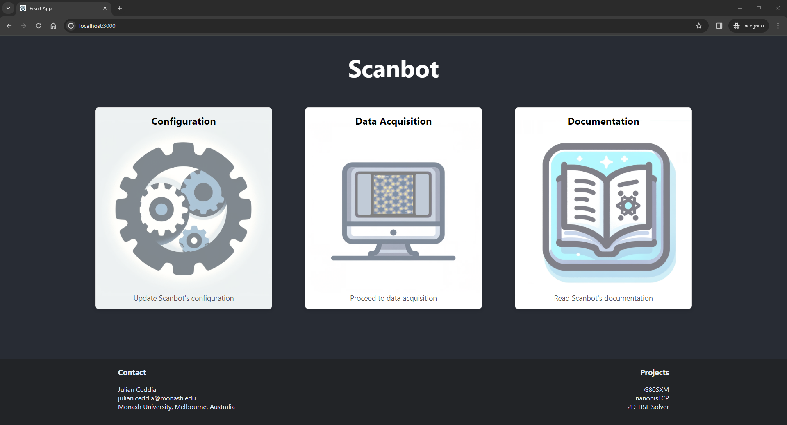
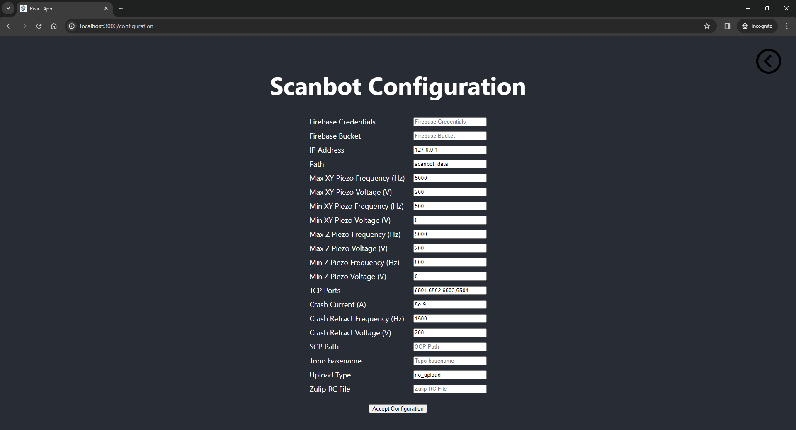
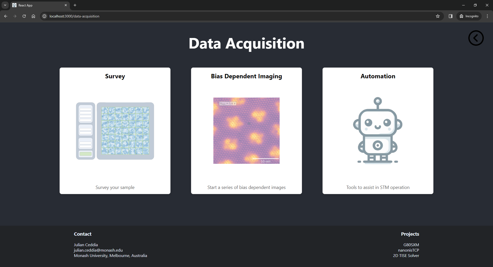
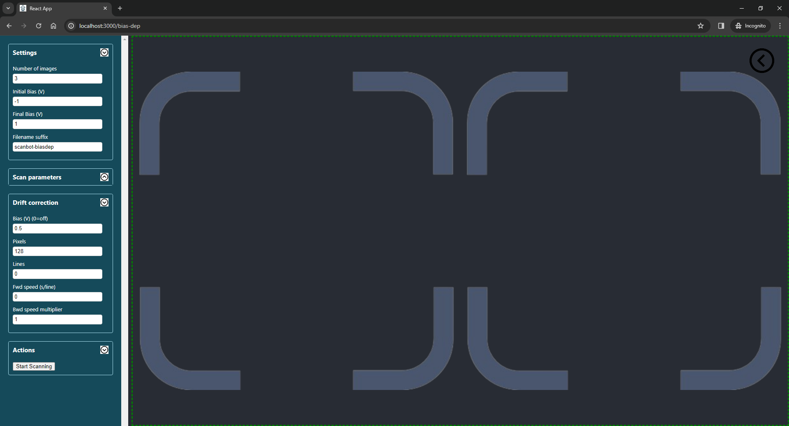
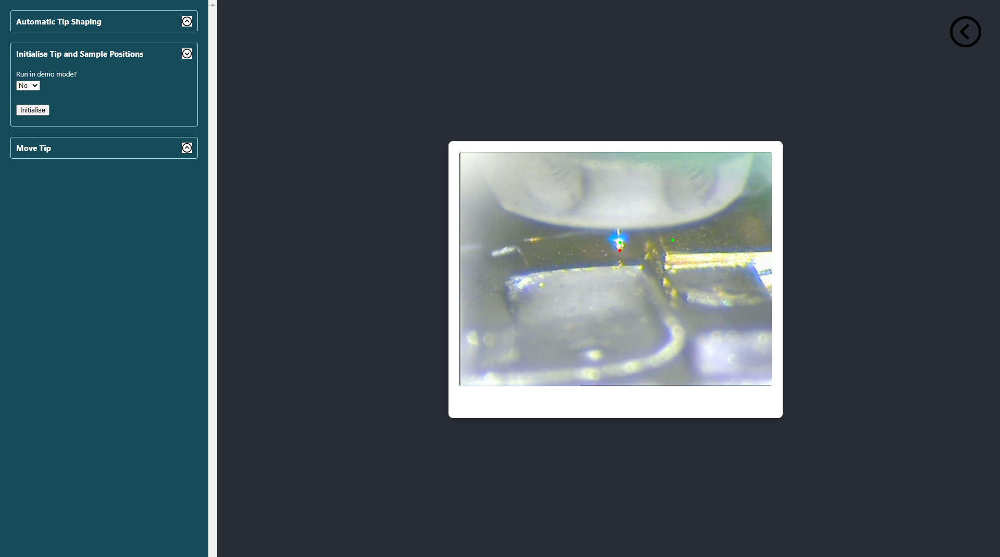

<!-- Google tag (gtag.js) -->
<script async src="https://www.googletagmanager.com/gtag/js?id=G-6MK4DRHXWM"></script>
<script>
  window.dataLayer = window.dataLayer || [];
  function gtag(){dataLayer.push(arguments);}
  gtag('js', new Date());

  gtag('config', 'G-6MK4DRHXWM');
</script>
# Scanbot Web App

Scanbot is available as a web application developed with [React](https://react.dev/).
This application is still being developed, with the following features already fully implemented:

* Sample Surveying
* Bias Dependent Imaging
* Tip Shaping
* End-To-End Survey Automation



# Installation


There are several ways to install Scanbot:

1. For a quick start on Windows, download and run the .exe file from <a href="https://scanbot-46390.web.app" target="_blank">here</a>.
This method automatically sets up and launches the Scanbot web app.

2. Installing via pip
If you prefer using pip, you can install Scanbot directly with the following command:
<br>
```pip install scanbot```
<br><br>
You can then launch Scanbot by running the command:
<br>
```scanbot```

3. Building from Source:

    1. Clone the [Scanbot repository](https://github.com/New-Horizons-SPM/scanbot)
    2. Install node.js from [here](https://nodejs.org/en) or if you're using anaconda, run ```conda install conda-forge::nodejs```
    3. Navigate to ```scanbot/scanbot/App``` and run ```npm install```
    4. From the same directory, run ```npm run build```
    5. Navigate to the project root directory, and run ```pip install .```
    6. Start Scanbot by running the command ```scanbot```

<br>

<strong>You can test Scanbot with the Nanonis V5 Simulator</strong> before integrating it with your STM by following [these instructions](../web-app-test).</strong>

# Configuration
From the landing page, you can access Scanbot's configuration.
It is recommended that you review the default settings before using any of the tools in Scanbot.
Upon accepting the configuration, your scanbot_config.ini file will be saved automatically and your settings will be remembered.
These settings can be updated any time. <strong>For a detailed description about the configurable parameters, see 
[configuration](../configuration).</strong>


# Data Acquisition
From the landing page, you can access the data acquisition tools, including tools to help automate the STM.


## Survey


When the Survey function is selected, the parameters in the table below can be configured.
Note that answering ```Yes``` to ```Auto tip shaping?```, is only possible after following a short
[initialisation procedure](#automation). After completing this initialisation procedure, Scanbot can integrate the automated tip shaping with sample surveying. The process is as follows:
1. Images acquired during the survey are analysed and deemed 'good' or 'bad' based on how much the tip interacts with the sample.
2. If <strong>five 'bad' images are detected in a row</strong>, the survey will be stopped. Scanbot will then use the camera feed to track and move the tip to the clean reference metal.
3. Upon appraching on the clean reference metal, Scanbot will launch the automated tip shaping routine.
4. After acquiring a tip suitable for imaging, Scanbot will move the STM tip back to the sample of interest.
5. A new survey will automatically begin.

<strong>It's a good idea to go through [these steps](../web-app-test) using the Nanonis Simulator to get comfortable with how Scanbot automates surveys before trying this on your STM.</strong>

| Parameter                                            | Description                                                                                                                                                                                                                                                                                                                             |
|------------------------------------------------------|-----------------------------------------------------------------------------------------------------------------------------------------------------------------------------------------------------------------------------------------------------------------------------------------------------------------------------------------|
| Survey fine grid size (NxN)                          | Surveys are grids of images. This parameter defines the grid size. For example, if N=3, the survey grid will be 9 images in a 3x3 grid                                                                                                                                                                                                  |
| Survey coarse grid size X/Y                          | The coarse grid is a macroscopic grid of points on the sample where surveys will be carried out.<br>At the completion of each survey, the coarse piezos will move the tip to the next location in the course grid.<br>The course grid size is XxY.<br>For example, if X=5 and Y=2, a total of 10 fine-grid surveys will be carried out. |
| Scan size (m)                                        | Length and width of each image in the survey in meters                                                                                                                                                                                                                                                                                  |
| Scan spacing (m)                                     | Spacing between images in a survey in meters                                                                                                                                                                                                                                                                                            |
| Number of pixels                                     | Number of pixels in each image in the survey                                                                                                                                                                                                                                                                                            |
| Scan bias (V)                                        | Bias the images in the survey will be acquired at                                                                                                                                                                                                                                                                                       |
| Filename suffix                                      | String that will be appended to the end of the .sxm filenames for all images acquired in the survey                                                                                                                                                                                                                                     |
| Drift compensation (s)                               | Number of seconds after which to restart each scan. This is to accommodate for drift induced by the scan frame moving.                                                                                                                                                                                                                  |
| Number of motor steps (Z+)                           | Number of motor steps the tip will retract before moving to the next survey location in the coarse grid                                                                                                                                                                                                                                 |
| Piezo voltage during Z+ motor steps (V)              | Voltage applied to the Z piezos when retracting the tip before moving to the next coarse grid location                                                                                                                                                                                                                                  |
| Piezo frequency during Z+ motor steps (Hz)           | Frequency applied to the Z piezos when retracting the tip before moving to the next coarse grid location                                                                                                                                                                                                                                |
| Number of motor steps (X/Y)                          | Number of piezo motor steps (after retracting in Z+) between coarse grid locations                                                                                                                                                                                                                                                      |
| Piezo voltage during X/Y motor steps (V)             | Voltage applied to the X/Y piezos when moving to the next coarse grid location                                                                                                                                                                                                                                                          |
| Piezo Frequency during X/Y motor steps (Hz)          | Frequency applied to the X/Y piezos when moving to the next coarse grid location                                                                                                                                                                                                                                                        |
| Call hk_survey.py after each image?                  | Answer 'Yes' if you've written a custom hk_hook.py hook that you want executed after each scan completes                                                                                                                                                                                                                                |
| Call hk_classifier.py instead of default classifier? | Answer 'Yes' if you've written a custom hk_classifier.py hook to analyse completed scans and determine if the tip needs reshaping                                                                                                                                                                                                       |
| Auto tip shaping?                                    | Answer 'Yes' if you want Scanbot to automatically move the tip to the clean reference metal and reshape the tip when it detects a bad tip                                                                                                                                                                                               |

## Bias Dependent Imaging

The bias dependent imaging function lets you take a series of drift-corrected images at different bias values. The plot area will show the latest image side-by-side with a GIF of all the previously acquired images in the set.


When the Bias Dependent function is selected, the following parameters can be configured:

| Parameter                                            | Description                                                                                                                                                                 |
|------------------------------------------------------|-----------------------------------------------------------------------------------------------------------------------------------------------------------------------------|
| Number of images                                     | Number of images to acquire between the initial and final bias                                                                                                              |
| Initial bias (V)                                     | Bias of the first image in the set                                                                                                                                          |
| Final bias (V)                                       | Bias of the final image in the set                                                                                                                                          |
| Pixels in data image                                 | Number of pixels in the bias dependent scans. This must be a multiple of 16 in nanonis                                                                                      |
| Lines in data image                                  | Number of lines in the bias dependent scans                                                                                                                                 |
| Time per line during data acquisition (s)            | Sets the forward speed of the tip during bias dependent scans                                                                                                               |
| Backwards time per line multiplier                   | Sets the backward speed of the tip during bias dependent scans. (2 = twice as fast as the forward speed)                                                                    |
| Pixels in drift correction image                     | Number of pixels during the frames taken for drift correction purposes.<br>A drift correction frame is acquired between each of the bias dependent scans at a constant bias |
| Lines in drift correction image                      | Number of lines during the frames taken for drift correction purposes.<br>Set this to 0 to keep the same ratio as pixels/lines in the bias dependent images                 |
| Bias during drift correction (V)                     | Bias that the drift correction frames are acquired at.<br>Set this to 0 to turn off drift correction                                                                        |
| Time per line during drift correction (s)            | Sets the forward speed of the tip when acquiring drift correction images                                                                                                    |
| Backwards time per line multiplier                   | Sets the backward speed of the tip during drift correction scans. (0.5 = half the speed as the forward speed)                                                               |
| Suffix                                               | Text to append to the .sxm filenames for all images in this set                                                                                                             |

# Automation

From the Automation screen, you can initiate the following actions:

* Automated tip shaping
* Tip, sample, and reference metal initialisation
* Move tip to sample/metal

## Automated Tip Shaping

Scanbot can [automatically acquire a tip](../automation/#tip-preparation) suitable for imaging via its tip-shaping protocol. The process is as follows:

1. An NxN grid is set up within the scannable region
2. A small scan is acquired at the first location in the grid
3. If the scanned region is flat/clean, it is deemed suitable for creating an imprint. If not, the scan frame is moved to the next location in the grid and the process repeats
4. The tip apex creates an imprint in the middle of the scan window via a gentle tip-shaping action
5. The imprint of the tip apex is imaged
6. The imprint is analysed and given a size score (in units of nm2) and a circularity score (from 0 to 1)
7. If the target size and circularity values are not met, the scan frame moves to the next location and the process is repeated
8. If the target size and circularity values are met, the process completes

When intitiated from the Automation screen, the plot area will show the latest tip imprint alongside a GIF of all previous tip imprints from the given run.
This lets you observe how the geometry at the apex of the probe evolves with each iteration.


The following parameters can be configured for this action:

| Parameter                                                 | Description                                                                                                                                                                               |
|-----------------------------------------------------------|-------------------------------------------------------------------------------------------------------------------------------------------------------------------------------------------|
| Tip shaping grid size (NxN)                               | The total number of tip-shaping attempts will be NxN                                                                                                                                      |
| Scan size (m)                                             | Size of the scan window when imaging the tip imprint                                                                                                                                      |
| Desired symmetry (0=asymmetric, 1=perfect circle)         | Circularity score that needs to be met before tip-shaping is successful.<br>The imprint circularity is calculated by analysing its contour.<br>0.85 or more will generally be good enough |
| Maximum size (nm2)                                        | Maximum area in units of nm2 of the imprint.<br>This will vary for different metal surfaces.<br>2.5 is a good starting point                                                              |
| Tip depth when assessing imprint (m)                      | Amount to crash the tip when creating an imprint to be analysed.<br>This will vary for different metal surfaces.<br>-1.1e-9 is a good starting point                                      |
| Tip depth when reshaping the tip (m)                      | Maximum amount to crash the tip when reshaping it.<br>-10e-9 to -15e-9 is a good starting point if the rng is turned on                                                                   |
| Randomise tip depth from 0 to above value when reshaping? | Randomising the tip crash depth from zero to a maximum value seems to work better than try the same value over and over.<br>Generally select 'Yes' for this option                        |
| Drift compensation time (s)                               | Restarts each scan after this many seconds to compensate for drift when moving scan frames.<br>1 s is generally ok here                                                                   |
| Demo mode?                                                | Load pngs from a pickled file instead of scan window (useful for testing purposes)                                                                                                        |
| Call the hook hk_tipshape?                                | Call your own hk_tipshape.py hook to configure custom tip-shaping parameters based on images of the tip's imprint                                                                         |

## Initialising the Tip, Sample, and Reference Metal Locations

Before the automatic tip preparation can be incorporated into surveys, the tip, sample, and clean reference metal locations must be initialised.
This allows Scanbot to later track and maneuver the tip via the camera feed when required.
From the Automation screen, simply click the 'initialise' button, allow the browser to use the camera, and follow the prompts.
Once these locations are initialised, you will be able to answer 'Yes' to the ```Automated Tip Shaping?``` field in the Survey screen.
In the screenshot below, the red marker indicates the initial position for the tip's apex;
the green markers show the locations of the sample and clean reference metal.



## Move Tip

After initialising the tip, sample, and reference metal locations, you will be able to tell Scanbot to track and move the STM tip from its current position to either the sample or reference metal locations.
<strong>Scanbot will always move the tip in the positive Z direction until the tip apex is above the target location. Only then will the X piezo be used to move the tip to its target.</strong>
The 'Go to Metal' and 'Go to Sample' buttons are intended to be used for testing purposes to see how well Scanbot can track the STM tip with your camera setup and specific lighting conditions.

<strong>Note:</strong>
The primary concern when it comes to automating movement of the STM head is accidental tip crashes.
The following rules have been applied to any command where the coarse piezos are utilised:
<br>

- Scanbot can never move the tip in the ```Z-``` direction (down) when using the coarse piezo. Instead, auto approach is used.
- When moving in ```X``` or ```Y``` directions, the tunnelling current must be monitored after every 10 steps.
- A tunnelling current greater than the threshold set in the configuration is considered a crash (see [Tip Crash Safety](../configuration/#tip-crash-safety)).
- In the event of a crash, the tip will be retracted using the ```Z+``` piezo and operation will cease.

**Please make sure to set appropriate piezo voltages and frequencies when using any of the commands that control the coarse piezos. You can configure appropriate safety settings from the Configuration screen.**
<br><br><br>
